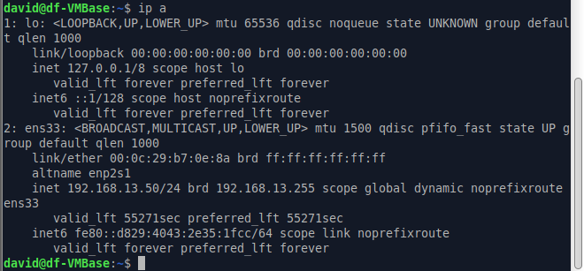
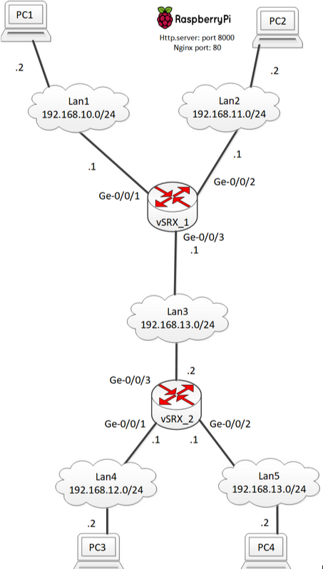

# Netværk opg 18: DHCP på virtuel router, server og relay
<br>
Pc4's IPv4 indstillinger som den får fra router2 relay.

## Config
Router1 DHCP server
```
version 12.1X47-D15.4;
system {
    host-name R2;
    /* User: root Password: Rootpass */
    root-authentication {
        encrypted-password "$1$xH9xJoL6$MFOUYnZr4.Qj2NM24XInz/";
    }
    services {
        ssh;
        dhcp {
            /* Net1 */
            pool 192.168.10.0/24 {
                address-range low 192.168.10.50 high 192.168.10.60;
                name-server 8.8.8.8;
                router 192.168.10.1;
                default-lease-time 60000; /* seconds. 60 for test! */
            }
            /* Net2 */
            pool 192.168.11.0/24 {
                address-range low 192.168.11.70 high 192.168.11.80;
                name-server 8.8.8.8;
                router 192.168.11.1;
                default-lease-time 60000; /* seconds. 60 for test! */
            }
        }
    }
}
interfaces {
    ge-0/0/1 {
        unit 0 {
            family inet {
                address 192.168.10.1/24;
            }
        }
    }
    ge-0/0/2 {
        unit 0 {
            family inet {
                address 192.168.11.1/24;
            }
        }
    }
    ge-0/0/3 {
        unit 0 {
            family inet {
				address 10.10.10.11/24;
                
            }
        }
    }
}
routing-options {
    static {
        route 192.168.12.0/24 next-hop 10.10.10.12;
        route 192.168.13.0/24 next-hop 10.10.10.12;
    }
}
security {
    policies {
        from-zone trust to-zone trust {
            policy default-permit {
                match {
                    source-address any;
                    destination-address any;
                    application any;
                }
                then {
                    permit;
                }
            }
        }
    }
    zones {
        security-zone trust {
            interfaces {
                ge-0/0/1.0 {
                    host-inbound-traffic {
                        system-services {
                            ping;
                            ssh;
							dhcp; /* Open for access to DHCP server */
                        }
                    }
                }
                ge-0/0/2.0 {
                    host-inbound-traffic {
                        system-services {
                            ping;
                            ssh;
                            dhcp; /* Open for access to DHCP server */
                        }
                    }
                }
                ge-0/0/3.0 {
                    host-inbound-traffic {
                        system-services {
                            ping;
                            ssh;
                            
                        }
                    }
                }
            }
        }
    }
}
```
Router2 DHCP server
```
version 12.1X47-D15.4;
system {
    host-name R2;
    /* User: root Password: Rootpass */
    root-authentication {
        encrypted-password "$1$xH9xJoL6$MFOUYnZr4.Qj2NM24XInz/";
    }
    services {
        ssh;
        dhcp {
            /* Net1 */
            pool 192.168.12.0/24 {
                address-range low 192.168.12.50 high 192.168.12.60;
                name-server 8.8.8.8;
                router 192.168.12.1;
                default-lease-time 60000; /* seconds. 60 for test! */
            }
            /* Net2 */
            pool 192.168.13.0/24 {
                address-range low 192.168.13.70 high 192.168.13.80;
                name-server 8.8.8.8;
                router 192.168.13.1;
                default-lease-time 60000; /* seconds. 60 for test! */
            }
        }
    }
}
interfaces {
    ge-0/0/1 {
        unit 0 {
            family inet {
				address 192.168.12.1/24;
            }
        }
    }
    ge-0/0/2 {
        unit 0 {
            family inet {
                address 192.168.13.1/24;
            }
        }
    }
    ge-0/0/4 {
        unit 0 {
            family inet {
				address 10.10.10.12/24;
                
            }
        }
    }
}
routing-options {
    static {
        route 192.168.10.0/24 next-hop 10.10.10.11;
        route 192.168.11.0/24 next-hop 10.10.10.11;
    }
}
security {
    policies {
        from-zone trust to-zone trust {
            policy default-permit {
                match {
                    source-address any;
                    destination-address any;
                    application any;
                }
                then {
                    permit;
                }
            }
        }
    }
    zones {
        security-zone trust {
            interfaces {
                ge-0/0/1.0 {
                    host-inbound-traffic {
                        system-services {
                            ping;
                            ssh;
							dhcp; /* Open for access to DHCP server */
                        }
                    }
                }
                ge-0/0/2.0 {
                    host-inbound-traffic {
                        system-services {
                            ping;
                            ssh;
                            dhcp; /* Open for access to DHCP server */
                        }
                    }
                }
                ge-0/0/4.0 {
                    host-inbound-traffic {
                        system-services {
                            ping;
                            ssh;
                            
                        }
                    }
                }
            }
        }
    }
}
```
Router1 DHCP server (relay)
```
version 12.1X47-D15.4;
system {
    host-name R1;
    /* User: root Password: Rootpass */
    root-authentication {
        encrypted-password "$1$xH9xJoL6$MFOUYnZr4.Qj2NM24XInz/";
    }
    services {
        ssh;
		dhcp-local-server {
            group Net1 {
                interface ge-0/0/1.0;
            }
            group Net2 {
                interface ge-0/0/2.0;
            }
            group Net3 {
				interface ge-0/0/3.0;   
            }
			group Net4 {
				apply-groups my-ge-0/0/3-group;
			}
        }
    }
}
groups {
    my-ge-0/0/3-group {
        interfaces {
            ge-0/0/3 {
                unit 0 {
                    family inet {
                        address 10.10.10.11/24;
                    }       
                }
            }
        }
    }
}
interfaces {
    ge-0/0/1 {
        unit 0 {
            family inet {
                address 192.168.10.1/24;
            }
        }
    }
    ge-0/0/2 {
        unit 0 {
            family inet {
                address 192.168.11.1/24;
            }
        }
    }
    apply-groups my-ge-0/0/3-group;
}
routing-options {
    static {
        route 192.168.12.0/24 next-hop 10.10.10.12;
        route 192.168.13.0/24 next-hop 10.10.10.12;
    }
}
security {
    policies {
        from-zone trust to-zone trust {
            policy default-permit {
                match {
                    source-address any;
                    destination-address any;
                    application any;
                }
                then {
                    permit;
                }
            }
        }
    }
    zones {
        security-zone trust {
            interfaces {
                ge-0/0/1.0 {
                    host-inbound-traffic {
                        system-services {
                            ping;
                            ssh;
							dhcp; /* Open for access to DHCP server */
                        }
                    }
                }
                ge-0/0/2.0 {
                    host-inbound-traffic {
                        system-services {
                            ping;
                            ssh;
                            dhcp; /* Open for access to DHCP server */
                        }
                    }
                }
                ge-0/0/3.0 {
                    host-inbound-traffic {
                        system-services {
                            ping;
                            ssh;
                            dhcp;
                        }
                    }
                }
            }
        }
    }
}
access {
    address-assignment {
        pool Net1 {
            family inet {
                network 192.168.10.0/24;
                range USERS {
                    low 192.168.10.50;
                    high 192.168.10.60;
                }
                dhcp-attributes {
                    maximum-lease-time 60000; /* seconds */
                    name-server {
                        8.8.8.8;
                    }
                    router {
                        192.168.10.1;
                    }
                }
            }
        }
        pool Net2 {
            family inet {
                network 192.168.11.0/24;
                range USERS {
                    low 192.168.11.50;
                    high 192.168.11.60;
                }
                dhcp-attributes {
                    maximum-lease-time 60000; /* seconds */
                    name-server {
                        8.8.8.8;
                    }
                    router {
                        192.168.11.1;
                    }
                }
            }
        }
        pool Net3 {
            family inet {
                network 192.168.12.0/24;
                range USERS {
                    low 192.168.12.50;
                    high 192.168.12.60;
                }
                dhcp-attributes {
                    maximum-lease-time 60000; /* seconds */
                    name-server {
                        8.8.8.8;
                    }
                    router {
                        192.168.12.1;
                    }
                }
            }
        }
        pool Net4 {
            family inet {
                network 192.168.13.0/24;
                range USERS {
                    low 192.168.13.50;
                    high 192.168.13.60;
                }
                dhcp-attributes {
                    maximum-lease-time 60000; /* seconds */
                    name-server {
                        8.8.8.8;
                    }
                    router {
                        192.168.13.1;
                    }
                }
            }
        }
    }
}
```
Router2 DHCP relay
```
version 12.1X47-D15.4;
system {
    host-name R2;
    /* User: root Password: Rootpass */
    root-authentication {
        encrypted-password "$1$xH9xJoL6$MFOUYnZr4.Qj2NM24XInz/";
    }
}
interfaces {
    ge-0/0/1 {
        unit 0 {
            family inet {
				address 192.168.12.1/24;
            }
        }
    }
    ge-0/0/2 {
        unit 0 {
            family inet {
                address 192.168.13.1/24;
            }
        }
    }
    ge-0/0/4 {
        unit 0 {
            family inet {
				address 10.10.10.12/24;
                
            }
        }
    }
}
routing-options {
    static {
        route 192.168.10.0/24 next-hop 10.10.10.11;
        route 192.168.11.0/24 next-hop 10.10.10.11;
    }
}
forwarding-options {
	helpers {
		bootp { /* Incoming BOOTP/DHCP request forwarding configuration */
			server 10.10.10.11;
			interface {
				ge-0/0/1;
				ge-0/0/2;
			}
		}
	}   
}
security {
    policies {
        from-zone trust to-zone trust {
            policy default-permit {
                match {
                    source-address any;
                    destination-address any;
                    application any;
                }
                then {
                    permit;
                }
            }
        }
    }
    zones {
        security-zone trust {
            interfaces {
                ge-0/0/1.0 {
                    host-inbound-traffic {
                        system-services {
                            ping;
                            ssh;
							dhcp; /* Open for access to DHCP server */
                        }
                    }
                }
                ge-0/0/2.0 {
                    host-inbound-traffic {
                        system-services {
                            ping;
                            ssh;
                            dhcp; /* Open for access to DHCP server */
                        }
                    }
                }
                ge-0/0/4.0 {
                    host-inbound-traffic {
                        system-services {
                            ping;
                            ssh;
                            dhcp;
                        }
                    }
                }
            }
        }
    }
}
```
# Netværk opg 53/54 SRX security, address book, security zones og policies


## Config
Konfiguration af VSRX router1
```
version 12.1X47-D15.4;
system {
    host-name vSRX_1;
    /* User: root Password: Rootpass */
    root-authentication {
        encrypted-password "$1$4TkbZDtp$6E8C6Bg7K6gnHR31XnJjl0";
    }
}
interfaces {
    ge-0/0/1 {
        unit 0 {
            family inet {
                address 192.168.10.1/24;
            }
        }
    }
    ge-0/0/2 {
        unit 0 {
            family inet {
                address 192.168.11.1/24;
            }
        }
    }
    ge-0/0/3 {
        unit 0 {
            family inet {
                address 10.10.10.1/30;
            }
        }
    }
}
routing-options {
    static {
        route 192.168.12.0/24 next-hop 10.10.10.2;
        route 192.168.13.0/24 next-hop 10.10.10.2;
    }
}
security {
    address-book {
        global {
            address LAN1 192.168.10.0/24;
            address LAN2 192.168.11.0/24;
			address LAN3 192.168.12.0/24;
			address LAN4 192.168.13.0/24;
            address PC2 192.168.11.2/32;
            address PC4 192.168.13.2/32;
            address-set LAN1_AND_LAN2 {
                address LAN1;
                address LAN2;
            }
            address-set LAN1_AND_PC4 {
                address LAN1;
                address PC4;
            }
        }
    }
    policies {
        from-zone LAN1 to-zone LAN2 {
            policy allow-icmp-udp-http-ports-80-8000 {
                match {
                    source-address any;
                    destination-address any;
                    /* udp enables traceroute */
                    application [ junos-icmp-ping
                                  /* junos-udp-any */
                                  junos-http
                                  my-http-8000];
                }
                then {
                    permit;
                }
            }
        }
        from-zone LAN1 to-zone LAN3 {
            policy allow-icmp-udp {
                match {
                    source-address any;
                    destination-address any;
                    application [ junos-icmp-ping junos-udp-any ];
                }
                then {
                    permit;
                }
            }
        }
		from-zone LAN2 to-zone LAN1 {
            policy allow-icmp-udp {
                match {
                    source-address any;
                    destination-address any;
                    application [ junos-icmp-ping junos-udp-any ];
                }
                then {
                    permit;
                }
            }
        }
		from-zone LAN2 to-zone LAN3 {
            policy allow-icmp-udp {
                match {
                    source-address any;
                    destination-address any;
                    application [ junos-icmp-ping junos-udp-any ];
                }
                then {
                    permit;
                }
            }
        }
        from-zone LAN3 to-zone LAN2 {
            policy allow-PC4-http-to-PC2 {
                match {
                    source-address PC4;
                    destination-address PC2;
                    application [ junos-http my-http-8000 ];
                }
                then {
                    permit;
                }
            }
        }
        default-policy {
            deny-all;
        }
    }
    zones {
        security-zone LAN1 {
            interfaces {
                ge-0/0/1.0 {
                    host-inbound-traffic {
                        system-services {
                            ping;
                        }
                    }
                }
            }
        }
        security-zone LAN2 {
            interfaces {
                ge-0/0/2.0 {
                    host-inbound-traffic {
                        system-services {
                            ping;
                        }
                    }
                }
            }
        }
        security-zone LAN3 {
            interfaces {
                ge-0/0/3.0 {
                    host-inbound-traffic {
                        system-services {
                            ping;
                        }
                    }
                }
            }
        }
    }
}
applications {
    application my-http-8000 {
        application-protocol http;
        protocol tcp; /* Protocol at layers below application layer */
        destination-port 8000;
    }
}
```

Konfiguration af VSRX router2
```
version 12.1X47-D15.4;
system {
    host-name vSRX_2;
    /* User: root Password: Rootpass */
    root-authentication {
        encrypted-password "$1$4TkbZDtp$6E8C6Bg7K6gnHR31XnJjl0";
    }
}
interfaces {
    ge-0/0/1 {
        unit 0 {
            family inet {
                address 192.168.12.1/24;
            }
        }
    }
    ge-0/0/2 {
        unit 0 {
            family inet {
                address 192.168.13.1/24;
            }
        }
    }
    ge-0/0/3 {
        unit 0 {
            family inet {
                address 10.10.10.2/30;
            }
        }
    }
}
routing-options {
    static {
        route 192.168.10.0/24 next-hop 10.10.10.1;
        route 192.168.11.0/24 next-hop 10.10.10.1;
    }
}
security {
    address-book {
        global {
			address LAN1 192.168.10.0/24;
			address LAN2 192.168.11.0/24;
            address LAN4 192.168.12.0/24;
            address LAN5 192.168.13.0/24;
            address PC2 192.168.11.2/32;
            address PC4 192.168.13.2/32;
            address-set LAN1_AND_LAN2 {
                address LAN1;
                address LAN2;
            }
            address-set LAN4_AND_LAN5 {
                address LAN4;
                address LAN5;
            }
        }
    }
    policies {
		from-zone LAN5 to-zone LAN3 {
            policy allow-PC4-http-to-PC2 {
                match {
                    source-address PC4;
                    destination-address PC2;
                    application [ junos-http my-http-8000 ];/* udp enables traceroute */
                }
                then {
                    permit;
                }
            }
        }
        from-zone LAN4 to-zone LAN5 {
             policy allow-LAN4-to-LAN5 {
                match {
                    source-address any;
                    destination-address any;
                    application [ junos-icmp-ping ];
                }
                then {
                    permit;
                }
            } 
        }
        from-zone LAN5 to-zone LAN4 {
            policy allow-LAN5-to-LAN4 {
                match {
                    source-address any;
                    destination-address any;
                    application [ junos-icmp-ping ];
                }
                then {
                    permit;
                }
            }
        }
		from-zone LAN3 to-zone LAN4 {
            policy allow-LAN3-to-LAN4 {
                match {
                    source-address any;
                    destination-address any;
                    application [ junos-icmp-ping ];
                }
                then {
                    permit;
                }
            }
        }
		from-zone LAN3 to-zone LAN5 {
            policy allow-LAN3-to-LAN5 {
                match {
                    source-address any;
                    destination-address any;
                    application [ junos-icmp-ping ];
                }
                then {
                    permit;
                }
            }
        }
        default-policy {
            deny-all;
        }
    }
    zones {
        security-zone LAN4 {
            interfaces {
                ge-0/0/1.0 {
                    host-inbound-traffic {
                        system-services {
                            ping;
                        }
                    }
                }
            }
        }
        security-zone LAN5 {
            interfaces {
                ge-0/0/2.0 {
                    host-inbound-traffic {
                        system-services {
                            ping;
                        }
                    }
                }
            }
        }
        security-zone LAN3 {
            interfaces {
                ge-0/0/3.0 {
                    host-inbound-traffic {
                        system-services {
                            ping;
                        }
                    }
                }
            }
        }
    }
}
applications {
    application my-http-8000 {
        application-protocol http;
        protocol tcp; /* Protocol at layers below application layer */
        destination-port 8000;
    }
}
```


# Netværk opg30: SRX config og topology


## Config
Konfiguration af SRX på VMWW til opg 30 i netværk 
```
version 12.1X47-D15.4;
system {
    host-name R2;
    /* User: root Password: Rootpass */
    root-authentication {
        encrypted-password "$1$xH9xJoL6$MFOUYnZr4.Qj2NM24XInz/";
    }
}

### Der bliver oprettet fire interfaces. Det første er et "dummy interface" ###
interfaces {
    ge-0/0/0 {
        unit 0 {
            family inet {
            }
        }
    }
    
    ge-0/0/1 {
        unit 0 {
            family inet {
                address 192.168.12.1/24;
            }
        }
    }

    ge-0/0/2 {
        unit 0 {
            family inet {
                address 192.168.13.1/24;
            }
        }
    }

    ge-0/0/3 {
        unit 0 {
            family inet {
                address 10.56.16.80/22;
            }
        }
    }
}

### Der oprettes en statisk default route ### 
routing-options {
    static {
        route 0.0.0.0/0 next-hop 10.56.16.1;
    }
}

### Opsætning af nat og security zones ###
security {
    nat {
        /* NAT changes the source address of egress IP packets */
        source {
            rule-set trust-to-untrust {
                from zone trust;
                to zone untrust;
                rule rule-any-to-any {
                    match {
                        source-address 0.0.0.0/0;
                        destination-address 0.0.0.0/0;
                    }
                    then {
                        source-nat {
                        /* Use egress interface source IP address */
                            interface;
                        }
                    }
                }
            }
        }
    }

### Sætter to policies op der tillader trust at snakke med trust men ikke den anden vej rundt ###  
    policies {
        from-zone trust to-zone trust {
            policy default-permit {
                match {
                    source-address any;
                    destination-address any;
                    application any;
                }
                then {
                    permit;
                }
            }
        }
        from-zone untrust to-zone trust {
            policy default-deny {
                match {
                    source-address any;
                    destination-address any;
                    application any;
                }
                then {
                    deny;
                }
            }
        }
        from-zone trust to-zone untrust {
            policy internet-access {
                match {
                    source-address any;
                    destination-address any;
                    application any;
                }
                then {
                    permit;
                }
            }
        }
    }

### De to zoner bliver tildelt de netværks adaptere de skal eje###
    zones {
        security-zone trust {
            interfaces {
                ge-0/0/1.0 {
                    host-inbound-traffic {
                        system-services {
                            ping;
                        }
                    }
                }
                ge-0/0/2.0 {
                    host-inbound-traffic {
                        system-services {
                            ping;
                        }
                    }
                }
            }
        }
        security-zone untrust {
            interfaces {
                ge-0/0/3.0 {
                    host-inbound-traffic {
                        system-services {
                            ping;
                        }
                    }
                }
            }
        }
    }
}

```