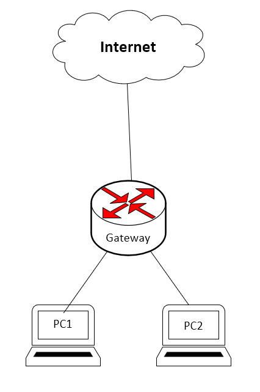

# Netværk opg30: SRX config og topology


## Config
Konfiguration af SRX på VMWW til opg 30 i netværk 
```
version 12.1X47-D15.4;
system {
    host-name R2;
    /* User: root Password: Rootpass */
    root-authentication {
        encrypted-password "$1$xH9xJoL6$MFOUYnZr4.Qj2NM24XInz/";
    }
}

### Der bliver oprettet fire interfaces. Det første er et "dummy interface" ###
interfaces {
    ge-0/0/0 {
        unit 0 {
            family inet {
            }
        }
    }
    
    ge-0/0/1 {
        unit 0 {
            family inet {
                address 192.168.12.1/24;
            }
        }
    }

    ge-0/0/2 {
        unit 0 {
            family inet {
                address 192.168.13.1/24;
            }
        }
    }

    ge-0/0/3 {
        unit 0 {
            family inet {
                address 10.56.16.80/22;
            }
        }
    }
}

### Der oprettes en statisk default route ### 
routing-options {
    static {
        route 0.0.0.0/0 next-hop 10.56.16.1;
    }
}

### Opsætning af nat og security zones ###
security {
    nat {
        /* NAT changes the source address of egress IP packets */
        source {
            rule-set trust-to-untrust {
                from zone trust;
                to zone untrust;
                rule rule-any-to-any {
                    match {
                        source-address 0.0.0.0/0;
                        destination-address 0.0.0.0/0;
                    }
                    then {
                        source-nat {
                        /* Use egress interface source IP address */
                            interface;
                        }
                    }
                }
            }
        }
    }

### Sætter to policies op der tillader trust at snakke med trust men ikke den anden vej rundt ###  
    policies {
        from-zone trust to-zone trust {
            policy default-permit {
                match {
                    source-address any;
                    destination-address any;
                    application any;
                }
                then {
                    permit;
                }
            }
        }
        from-zone untrust to-zone trust {
            policy default-deny {
                match {
                    source-address any;
                    destination-address any;
                    application any;
                }
                then {
                    deny;
                }
            }
        }
        from-zone trust to-zone untrust {
            policy internet-access {
                match {
                    source-address any;
                    destination-address any;
                    application any;
                }
                then {
                    permit;
                }
            }
        }
    }

### De to zoner bliver tildelt de netværks adaptere de skal eje###
    zones {
        security-zone trust {
            interfaces {
                ge-0/0/1.0 {
                    host-inbound-traffic {
                        system-services {
                            ping;
                        }
                    }
                }
                ge-0/0/2.0 {
                    host-inbound-traffic {
                        system-services {
                            ping;
                        }
                    }
                }
            }
        }
        security-zone untrust {
            interfaces {
                ge-0/0/3.0 {
                    host-inbound-traffic {
                        system-services {
                            ping;
                        }
                    }
                }
            }
        }
    }
}

```